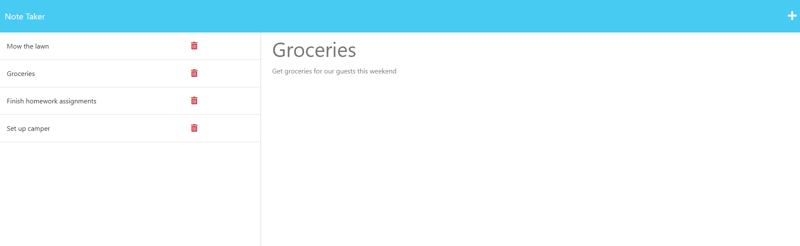

# Note Taking Express Web App
The following Express web application allows the user to take and store notes.

## Purpose of Assignment
 - The main focus of this assignment was using Express to build out the back end of a note taking website.
 - When the user goes to the landing page they click a start button that sends them to the note page.
 - On the notes page the user can enter new notes and look at old notes saved on the left hand side of the screen.

## Instructions for the User
 - Please use app and comment on any errors.

## Screen Shot of Working Application

## Link to GitHub Repository
[Click Here to View GitHub Repo](https://github.com/Aidan-Windebank/note-taker)

## Link to Deployed Web Application
[Click Here to Visit Web Application](https://aidan-note-taker-7067d23e4864.herokuapp.com/)